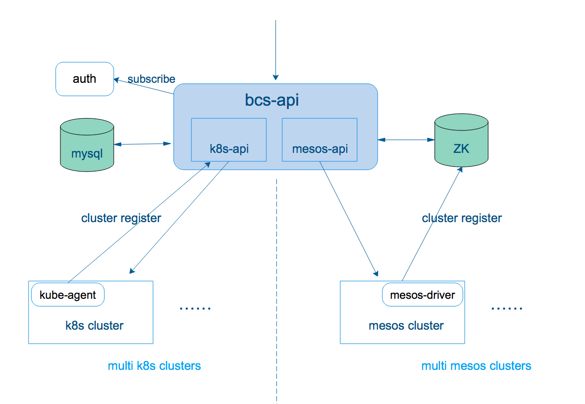

# 基于 k8s 的容器编排调度

## k8s 介绍
从几年前 docker 容器技术的一夜流行，到容器编排领域 swarm、kubernetes、mesos 的激烈竞争和角逐，再到近一年来云原生技术体系的蓬勃发展，kubernetes(以下简称 k8s) 已逐渐成为容器编排领域的事实标准。  
k8s 是一个开源的容器编排和调度框架，它是 Google 根据其内部使用的 Borg 系统改造而成并贡献给云原生基金会(CNCF)，自从开源以来，吸引了社区众多的开发者的参与以及各大云计算厂商的加入。  
目前 k8s 已经在大量的企业中落地，各大公有云厂商如 AWS、Azure 也把 k8s 作为基本的容器化编排方案来进行支持。  
更多 k8s 信息可参考：[ k8s 官方文档](https://kubernetes.io/zh/)

## bcs 对 k8s 的支持
bcs 是腾讯蓝鲸体系下，以容器技术为基础，为微服务业务提供编排管理和服务治理的基础服务平台。bcs 在后端支持基于 k8s 与 mesos 的双引擎编排，用户可以基于自己的业务需求，或者选择原生的 k8s 作为容器编排方案，或者选择蓝鲸自研的基于 mesos 的容器编排方案。  
bcs 在对社区原生的 k8s 容器编排进行支持的前提下，在跨云部署、多集群管理、事件监控告警等方面进行了一系列的增强和生态扩展，大大方便了用户特别是企事业用户对 k8s 容器云平台的使用和管理。  
下图是 bcs 通过 bcs 服务层的 bcs-api 管理多个 k8s 和 mesos 集群的架构图：  


bcs 在对多个 k8s 集群的管理上，使用 agent 上报作为服务发现的方式，在纳管的每个 k8s 集群中以 deployment 的形式部署一个 bcs-kube-agent ，bcs-kube-agent 会在 k8s 集群中以 in-cluster 的方式运行并获取集群的 master 地址、证书、userToken 等信息，周期性地上报给 bcs 服务层的 bcs-api 。bcs-api 保存各个集群的信息，并提供 k8s 原生的 API 。bcs 用户可通过 kubectl 或 API 直接调用 bcs-api ，bcs-api 会路由转发到后端的 k8s 集群，来实现对多个 k8s 集群的操作和管理。  
具体来说，bcs 在使用 k8s 作为容器编排的使用上，具有以下特性。  

### k8s 原生 API 支持
bcs 支持 k8s 的原生 API ，用户可以通过 bcs 提供的 k8s 原生 API 操作和管理 bcs 管理下的任意一个集群。  
bcs-api 提供的 k8s 原生 API 的调用形式为：  
/tunnels/clusters/{cluster_identifier}/{sub_path}  
其中，cluster_identifier 为这个 k8s 集群在 bcs-api 上的集群标识，sub_path 为 k8s 原生 API 的 uri。  

### 多集群管理
对于企业用户来说，最常见的场景就是运行多套 k8s 集群，每套集群运行不同的业务。这样，k8s 多集群的统一管理就成为一个亟待解决的需求。  
bcs 在一开始的设计上就考虑到了多集群管理的需求，通过 bcs ，用户不仅可以轻松实现 k8s 集群的自动化部署，而且可以将用户已有的 k8s 集群轻松纳入 bcs 的管理。  

#### 自动化部署 k8s 集群
蓝鲸的 bcs 是一整套容器编排和服务治理的平台体系，bcs 用户可以使用[bcs saas](https://github.com/Tencent/bk-bcs-saas) 的自动化部署方案轻松完成 k8s 集群的自动化部署。部署好一个 k8s 集群后，调用 bk-bcs 服务层的 bcs-api 的 API ，把 k8s 集群注册到 bcs 上，实现集群的纳管。  
如何纳管已有的 k8s 集群，可参考下一节。

#### 纳管已有 k8s 集群
使用 bcs 的自动化部署方案创建好一个 k8s 集群后，或者用户用其它方式已经部署了一个 k8s 集群，需要把这个 k8s 集群纳入 bcs 的管理，可以参考以下步骤：  

- 调用  bcs-api 的接口，注册集群  
```
# curl -i -X POST -d '{ "id": "k8s-004", "project_id": "project-004"}' -H 'Content-Type: application/json' -H  "Authorization: Bearer {userToken}" http://0.0.0.0:8080/rest/clusters/bcs
HTTP/1.1 200 OK
Content-Type: application/json
Date: Mon, 22 Jul 2019 11:58:31 GMT
Content-Length: 167

{
 "id": "bcs-k8s-004-eY0Vr8Si",
 "provider": 2,
 "creator_id": 1,
 "identifier": "bcs-k8s-004-ey0vr8si-UevSy9HBoYpkmw9J",
 "created_at": "2019-07-22T19:58:31+08:00"
}
```
id 和 project_id 为该集群在 bcs-bk-saas 层配置的集群 id 和项目 id ，注册成功后，会返回该集群在 bk-bcs 层的集群 id，集群 identifier 。  

- 生成 register_token
调用 bcs-api 的接口，为这个集群在 bk-bcs 上生成一个 register_token：  
```
# curl -i -X POST -H 'Content-Type: application/json' -H  "Authorization: Bearer {userToken}" http://0.0.0.0:8080/rest/clusters/bcs-k8s-004-eY0Vr8Si/register_tokens
HTTP/1.1 200 OK
Content-Type: application/json
Date: Mon, 22 Jul 2019 12:09:50 GMT
Content-Length: 247

[
 {
  "id": 2,
  "cluster_id": "bcs-k8s-004-eY0Vr8Si",
  "token": "ChqepBMMxBgiE3M5CQhwb6yUvep8o5zK7mwzCQ8luXn9gdBPBDmU2vQbKbu7sX0ExoPu5fwJm0PlJkvEqNumJ46sHDYgYUhqS09EH2VCl8VynDC3cs4dcFTN7XjSEG1d",
  "created_at": "2019-07-22T20:09:50+08:00"
 }
]
```

- 在 k8s 集群中部署 bcs-kube-agent  

生成 register_token 的 base64 编码：  
```
echo -n "ChqepBMMxBgiE3M5CQhwb6yUvep8o5zK7mwzCQ8luXn9gdBPBDmU2vQbKbu7sX0ExoPu5fwJm0PlJkvEqNumJ46sHDYgYUhqS09EH2VCl8VynDC3cs4dcFTN7XjSEG1d" | base64
Q2hxZXBCTU14QmdpRTNNNUNRaHdiNnlVdmVwOG81eks3bXd6Q1E4bHVYbjlnZEJQQkRtVTJ2UWJL
YnU3c1gwRXhvUHU1ZndKbTBQbEprdkVxTnVtSjQ2c0hEWWdZVWhxUzA5RUgyVkNsOFZ5bkRDM2Nz
NGRjRlRON1hqU0VHMWQ=
```

在 k8s 集群中使用以下的 yaml 文件部署 bcs-kube-agent:  

```
apiVersion: v1
kind: Secret
metadata:
  name: bke-info
  namespace: kube-system
type: Opaque
data:
  # 这里填register_token的64位编码
  token: Q2hxZXBCTU14QmdpRTNNNUNRaHdiNnlVdmVwOG81eks3bXd6Q1E4bHVYbjlnZEJQQkRtVTJ2UWJLYnU3c1gwRXhvUHU1ZndKbTBQbEprdkVxTnVtSjQ2c0hEWWdZVWhxUzA5RUgyVkNsOFZ5bkRDM2NzNGRjRlRON1hqU0VHMWQ=
  
---
apiVersion: v1
kind: ServiceAccount
metadata:
  name: bcs-kube-agent
  namespace: kube-system
  
---
kind: ClusterRoleBinding
apiVersion: rbac.authorization.k8s.io/v1beta1
metadata:
  name: bcs-kube-agent
roleRef:
  apiGroup: rbac.authorization.k8s.io
  kind: ClusterRole
  name: cluster-admin
subjects:
- kind: ServiceAccount
  name: bcs-kube-agent
  namespace: kube-system
---
apiVersion: extensions/v1beta1
kind: Deployment
metadata:
  name: bcs-kube-agent
  namespace: kube-system
spec:
  replicas: 1
  selector:
    matchLabels:
      app: bcs-kube-agent
  template:
    metadata:
      labels:
        app: bcs-kube-agent
    spec:
      containers:
      - name: bcs-kube-agent
        image: bcs-kube-agent:1.0
        imagePullPolicy: IfNotPresent
        args:
        # 这里填bcs-api的地址
        - --bke-address=https://x.x.x.x:8443
        # 这里填这个集群在bcs上的{cluster_id}
        - --cluster-id=bcs-k8s-004-eY0Vr8Si
        - --insecureSkipVerify           
        env:
          - name: REGISTER_TOKEN
            valueFrom:
              secretKeyRef:
                name: bke-info
                key: token
      serviceAccountName: bcs-kube-agent
```

- 通过 bcs-api 的 api 调用 k8s 集群
```
# curl -H  "Authorization: Bearer {userToken}" http://0.0.0.0:8080/tunnels/clusters/bcs-k8s-004-ey0vr8si-UevSy9HBoYpkmw9J/version
{
  "major": "1",
  "minor": "14",
  "gitVersion": "v1.14.1",
  "gitCommit": "b7394102d6ef778017f2ca4046abbaa23b88c290",
  "gitTreeState": "clean",
  "buildDate": "2019-04-08T17:02:58Z",
  "goVersion": "go1.12.1",
  "compiler": "gc",
  "platform": "linux/amd64"
}
``` 

- 通过 kubectl 操作 bcs-api 来操作 k8s 集群

配置 kubeconfig :  

kubeconfig.conf
```
apiVersion: v1
clusters:
- cluster:
    api-version: v1
    # bcs-api 的 ca 证书
    certificate-authority: /data/home/bryanhe/cert/bcs-inner-ca.crt
    server: https://0.0.0.0:8443/tunnels/clusters/bcs-k8s-004-ey0vr8si-UevSy9HBoYpkmw9J
  name: k8s-004
contexts:
- context:
    cluster: k8s-004
    user: admin
  name: admin
current-context: admin
kind: Config
users:
- name: admin
  user:
    token: {userToken}
```

使用 kubectl 操作集群：  
```
# kubectl --kubeconfig=./kubeconfig.conf get nodes

```

### 跨云的集群部署和管理 
bcs 可以实现跨云的多集群管理。只需要你打通网络，集群当中的 bcs-kube-agent 能够与 bcs-api 进行交互，就可实现使用一套 bcs 管理横跨公有云、跨私有云、跨企业内部 idc 的多个 k8s 集群的统一管理。  
结合蓝鲸的 bk-bcs-saas ，用户还可以在 bcs 上实现跨云跨集群的业务调度和管理。  

### 事件持久化
bcs 在 k8s 集群中部署了 bcs-k8s-watch 组件，bcs-k8s-watch 能够实时获取集群当中的所有 event 事件，并周期性地上报给 bcs 服务层的 bcs-storage 组件，由 bcs-storage 持久化到 mongodb 当中。bk-bcs-saas 或用户自定义的 saas 可以调用 bcs-api 的接口从 bcs-storage 中获取所有集群当中的所有事件，方便用户对 k8s 集群的告警和监控管理。

### 日志、告警方案
bcs 与蓝鲸整个生态体系实现了打通，使用 bcs 结合蓝鲸 bk-bcs-saas 、蓝鲸监控、蓝鲸作业平台、蓝鲸数据平台等，能够实现日志采集和监控告警等一整套完备的方案，对用户的业务上容器云保驾护航，给予最大化的生态支持。
