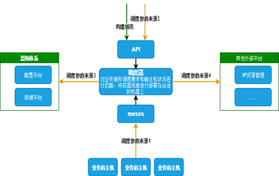
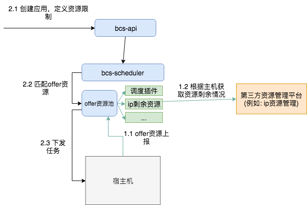

# 自定义编排调度策略
bcs mesos方案支持多种类型的调度参数来源：
1. 宿主机上报，例如：ip地址、端口、磁盘大小等
2. 用户自定义静态资源，例如：大区、环境等
3. 蓝鲸其它体系，例如：cmdb、数据平台等
4. 第三方平台动态获取，例如：容器ip剩余资源量



上述四种可以满足多种调度场景，其中第四种调度参数来源主要是为了满足一些动态的、变化的、从第三方系统获取的调度参数，例如：容器ip剩余资源量。
它是使用插件的方式实现的，业务可以根据自己的服务特点来定制化的实现。

## 自定义调度架构图


## 示例
```
import (
	"bk-bcs/bcs-common/common/plugin"
)

// plugin must implement
// func GetHostAttributes([]string) (map[string]*types.HostAttributes,error)
// func input: ip list, example: []string{"127.0.0.10","127.0.0.11","127.0.0.12"}
// func ouput: map key = ip, example: map["127.0.0.10"] = &types.HostAttributes{}
// implement func Init(para *types.InitPluginParameter) error
// func input: *types.InitPluginParameter
// func output: error

//for example

var initPara *plugin.InitPluginParameter

func Init(para *plugin.InitPluginParameter) error {
	initPara = para
	return nil
}

func Uninit() {
	//TODO
}

func GetHostAttributes(para *plugin.HostPluginParameter) (map[string]*plugin.HostAttributes, error) {
	atrrs := make(map[string]*plugin.HostAttributes)

	for _, ip := range para.Ips {
		hostAttr := &plugin.HostAttributes{
			Ip:         ip,
			Attributes: make([]*plugin.Attribute, 0),
		}

		atrri := &plugin.Attribute{
			Name:   "ip-resources",
			Type:   plugin.ValueScalar,
			Scalar: plugin.Value_Scalar{Value: 10},
		}
		hostAttr.Attributes = append(hostAttr.Attributes, atrri)

		atrrs[ip] = hostAttr
	}

	return atrrs, nil
}
```
上述是一个插件实现的例子，插件只需要实现方法GetHostAttributes即可。然后编译为so文件
```
go build -buildmode=plugin -o xxxx.so xxxxx.go
```
并且将插件.so文件放到bcs-scheduler相对路径./plugin/bin下面，然后增加启动参数"plugins": "xxxxx"，上述例子应该填写ip-resources。

